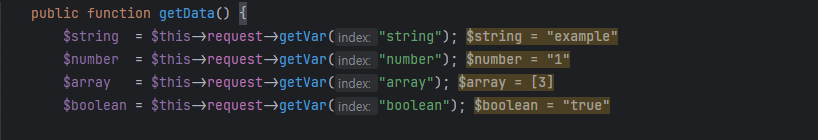

# PHP Debug Inline

A VS Code extension that enhances your debugging experience by showing variable values directly in the editor while debugging PHP code.

## Requirements

- [PHP Debug](https://marketplace.visualstudio.com/items?itemName=xdebug.php-debug) extension for VS Code

## Features

- Shows variable values inline during debugging
- Automatically displays:
  - Array access values
  - Loop control variables
  - Function parameters

### Installation

1. Open Visual Studio Code.
2. Go to the Extensions view (Ctrl+Shift+X or Cmd+Shift+X on Mac).
3. Search for **PHP Debug Inline**.
4. Click "Install."

### Feedback

Your feedback is invaluable! If you encounter any issues or have suggestions for improvements, please [report them](https://github.com/ericgomez/vscode-php-debug-inline/issues) here.

### License

This extension is licensed under the MIT License. See the [LICENSE](./LICENSE) file for details.

Enjoy coding with **PHP Debug Inline**! 🚀
